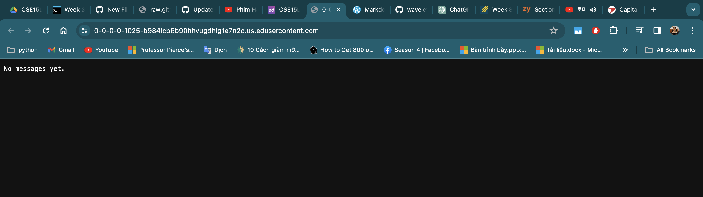
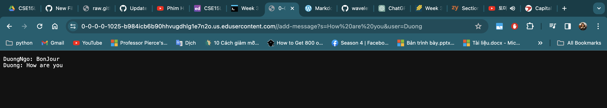

# LAB REPORT 2
# Name: Duong Ngo
# Professor: Joe Gibss Politz

* Task 1:
  1. This is the code for ChatServer.java:

`import java.io.IOException;
import java.net.URI;`

`class ChatHandler implements URLHandler {
    // Maintains the chat history
    String chatHistory = "";`

    public String handleRequest(URI url) {
        if (url.getPath().equals("/")) {
            return chatHistory.isEmpty() ? "No messages yet." : chatHistory;
        } else if (url.getPath().contains("/add-message")) {
            String[] parameters = url.getQuery().split("&");
            String message = "", user = "";

            for (String param : parameters) {
                String[] keyValue = param.split("=");
                if (keyValue[0].equals("s")) {
                    message = keyValue[1];
                } else if (keyValue[0].equals("user")) {
                    user = keyValue[1];
                }
            }

            chatHistory += user + ": " + message.replace("+", " ") + "\n";
            return chatHistory;
        } else {
            return "404 Not Found!";
        }
    }
`}`

`class ChatServer {
    public static void main(String[] args) throws IOException {
        if (args.length == 0) {
            System.out.println("Missing port number! Try any number between 1024 to 49151");
            return;
        }`

        int port = Integer.parseInt(args[0]);
        Server.start(port, new ChatHandler());
    }
`}`
This is the Server.java code in order to run the web with the port number:

`import java.io.IOException;
import java.io.OutputStream;
import java.net.InetSocketAddress;
import java.net.URI;`

`import com.sun.net.httpserver.HttpExchange;
import com.sun.net.httpserver.HttpHandler;
import com.sun.net.httpserver.HttpServer;`

`interface URLHandler {
    String handleRequest(URI url);
}`

`class ServerHttpHandler implements HttpHandler {
    URLHandler handler;
    ServerHttpHandler(URLHandler handler) {
      this.handler = handler;
    }`
    `public void handle(final HttpExchange exchange) throws IOException {
        // form return body after being handled by program
        try {
            String ret = handler.handleRequest(exchange.getRequestURI());
            // form the return string and write it on the browser
            exchange.sendResponseHeaders(200, ret.getBytes().length);
            OutputStream os = exchange.getResponseBody();
            os.write(ret.getBytes());
            os.close();
        } catch(Exception e) {
            String response = e.toString();
            exchange.sendResponseHeaders(500, response.getBytes().length);
            OutputStream os = exchange.getResponseBody();
            os.write(response.getBytes());
            os.close();`
        `}`
    `}`
`}`

`public class Server {
    public static void start(int port, URLHandler handler) throws IOException {
        HttpServer server = HttpServer.create(new InetSocketAddress(port), 0);`

        //create request entrypoint
        server.createContext("/", new ServerHttpHandler(handler));

        //start the server
        server.start();
        System.out.println("Server Started!");
    }
`}`

* Task 2:
  1. Initially, when we use no add commands yet for the web, it will appear with the message `No messages yet` as shown in image below.
  
  First, when running the web, it requires us 

  3. Writing ChatServer web and using two add commands which are `DuongNgo: BonJour` and `Duong: How are you`. Images attached below showing that after writing two commands which
  are `/add-message?s=BonJour&user=DuongNgo` and `/add-message?s=How are you&user=Duong`.
  

