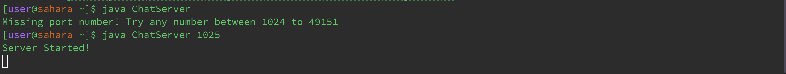
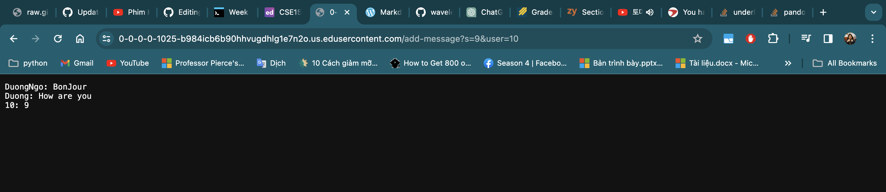
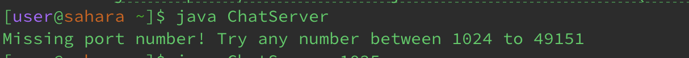
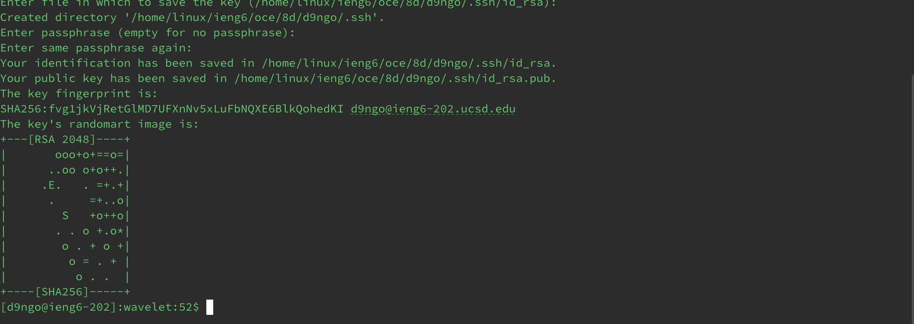
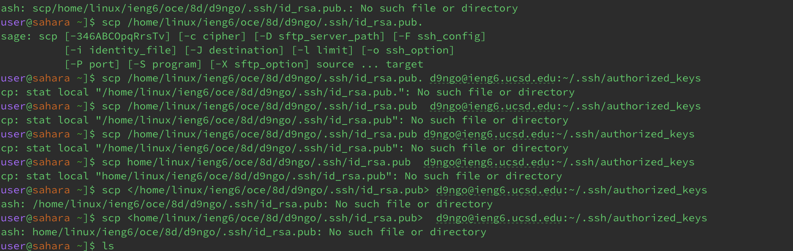

# LAB REPORT 2
# Name: Duong Ngo
# Professor: Joe Gibss Politz

* <u> Task 1:
<u> This is the code for ChatServer.java:
---

    
    import java.io.IOException;
    import java.net.URI;

    Class ChatHandler implements URLHandler {
      String chatHistory = "";
      public String handleRequest(URI url) {
        if (url.getPath().equals("/")) {
          return chatHistory.isEmpty() ? "No messages yet." : chatHistory;
          } else if (url.getPath().contains("/add-message")) {
              String[] parameters = url.getQuery().split("&");
              String message = "", user = "";

              for (String param : parameters) {
                  String[] keyValue = param.split("=");
                  if (keyValue[0].equals("s")) {
                      message = keyValue[1];
                  } else if (keyValue[0].equals("user")) {
                      user = keyValue[1];
                  }
            }

              chatHistory += user + ": " + message.replace("+", " ") + "\n";
              return chatHistory;
          } else {
              return "404 Not Found!";
            }
        }
      }

    Class ChatServer {
      public static void main(String[] args) throws IOException {
          if (args.length == 0) {
              System.out.println("Missing port number! Try any number between 1024 to 49151");
              return;
          }

          int port = Integer.parseInt(args[0]);
          Server.start(port, new ChatHandler());
      }
    }

---

<u> This is the Server.java code in order to run the web with the port number:

        import java.io.IOException;
        import java.ioOutputStream;
        import java.net.InetSocketAddress;
        import java.net.URI;
        
        import com.sun.net.httpserver.HttpExchange;
        import com.sun.net.httpserver.HttpHandler;
        import com.sun.net.httpserver.HttpServer;

        interface URLHandler {
            String handleRequest(URI url);
        }

        class ServerHttpHandler implements HttpHandler {
            URLHandler handler;
            ServerHttpHandler(URLHandler handler) {
                this.handler = handler;
        }

        public void handle(final HttpExchange exchange) throws IOException {
        // form return body after being handled by program
            try {
                String ret = handler.handleRequest(exchange.getRequestURI());
                // form the return string and write it on the browser
                exchange.sendResponseHeaders(200, ret.getBytes().length);
                OutputStream os = exchange.getResponseBody();
                os.write(ret.getBytes());
                os.close();
            } catch(Exception e) {
                String response = e.toString();
                exchange.sendResponseHeaders(500, response.getBytes().length);
                OutputStream os = exchange.getResponseBody();
                os.write(response.getBytes());
                os.close();
                }
            }
        }
        public class Server {
            public static void start(int port, URLHandler handler) throws IOException {
                HttpServer server = HttpServer.create(new InetSocketAddress(port), 0);

                //create request entrypoint
                server.createContext("/", new ServerHttpHandler(handler));

                //start the server
                server.start();
                System.out.println("Server Started!");
                }
        }

* <u> Task 2:
  1. Initially, when we use no add commands yet for the web, it will appear with the message `No messages yet` as shown in image below.
  
  First, when running the web, it requires us to choose the port number so that it can run the program for example in the image shown below.
  
  2. Secondly, writing ChatServer web and using two add commands which are `DuongNgo: BonJour` and `Duong: How are you`. Images attached below showing that after writing two commands which
  are `/add-message?s=BonJour&user=DuongNgo` and `/add-message?s=How are you&user=Duong`.
  
* Using the `/add-message?s=BonJour&user=DuongNgo`:
* The method `url.getPath().contains("/add-message")` will be called. We pass the values of `String message = ""` in this case will be
  `String message = "Bonjour"` and value of `user = ""` in this case will be `user = "DuongNgo"`. After the `for` loop, it will print the message added run by the code `chatHistory += user + ": " + message.replace("+", " ") + "\n";` and print out the String `DuongNgo: BonJour`.
*Similarly, using the `/add-message?s=How are you&user=Duong` so the method `url.getPath().contains("/add-message")` will be called. By this line of code `String[] parameters = url.getQuery().split("&");`, it will split the String `How are you` and the user `Duong` so we can get space on our message printed out. After the `for` loop, it will print the message added run by the code `chatHistory += user + ": " + message.replace("+", " ") + "\n";` and print out the String `Duong: How are you`.
* If the value changes, in the image shown below, if I use integer instead of string, I still get the same output printed.
  
  If I don't insert any port number in the terminal when running the program, it will show no port number error run by the code line  `if (args.length == 0) {
    System.out.println("Missing port number! Try any number between 1024 to 49151");
      return;
  }`
Because arg.length is zero as we pass no value to it, it will print out the error message.

<u> Task3: 

*In the image shown below, it shows a public key path to my username which is `/home/linux/ieng6/oce/8d/d9ngo/.ssh/id_rsa.pub.`. 

I have trouble accessing the private key path so it showed this image instead. I think I need to ask TA after the first submission of Lab2 Report. 

<u> Task4: 

This course is eye-opening for me due to my first time using terminal to run programs or websites. This is interesting to me because I 
did not have to manually access files or webs manually by hands. There are several things I learned from this class in the first three weeks, but the most impressive thing I learned is to use `ssh` to connect our computer server to the UCSD server which is a remote room in the school. Additionally, by experiencing using the port number to share websites to my groupmates, I find it so cool to create lots of ideas about chatroom or places to share images in just one website. I'm looking forward to know more about how terminal works deep down in the computer system as well as improving my coding and problem solving skill. 

